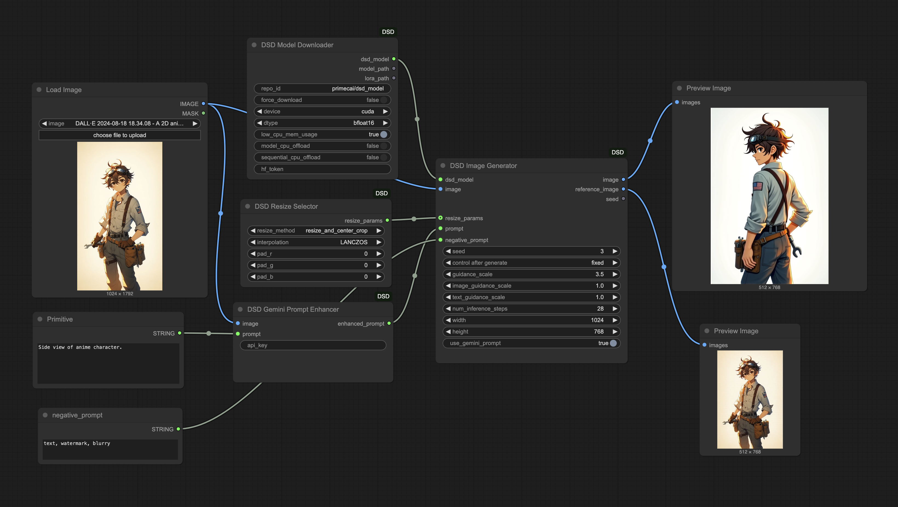

# ComfyUI-DSD

An Unofficial ComfyUI custom node package that integrates [Diffusion Self-Distillation (DSD)](https://github.com/primecai/diffusion-self-distillation) for zero-shot customized image generation.

DSD is a model for subject-preserving image generation that allows you to create images of a specific subject in novel contexts without per-instance tuning.

## Features

- Subject-preserving image generation using DSD model
- Gemini API prompt enhancement
- Direct model download from Hugging Face
- Fine-grained control over generation parameters
- Multiple image resizing options

## Installation

1. Clone this repository into your ComfyUI custom_nodes folder:

```bash
cd ComfyUI/custom_nodes
git clone https://github.com/irreveloper/ComfyUI-DSD.git
```

2. Install the required dependencies:

```bash
pip install -r requirements.txt
```

3. Get the model files (two options):
   - **Option 1**: Use the `DSD Model Downloader` node in ComfyUI to automatically download the model
   - **Option 2**: Download manually from [Hugging Face](https://huggingface.co/primecai/dsd_model) or [Google Drive](https://drive.google.com/drive/folders/1VStt7J2whm5RRloa4NK1hGTHuS9WiTfO?usp=sharing)

   The model files will be stored in:
   - `ComfyUI/models/dsd_model/transformer/` (for transformer files)
   - `ComfyUI/models/dsd_model/pytorch_lora_weights.safetensors` (for LoRA file)

4. Restart ComfyUI

## Available Nodes

1. **DSD Model Downloader**: Automatically downloads the model from Hugging Face
   - Supports downloading from custom repositories with the `repo_id` parameter
   - Includes options for model precision (bfloat16, float16, float32)
   - Provides memory optimization options (low_cpu_mem_usage, model_cpu_offload, sequential_cpu_offload)
   - Optional Hugging Face token support via parameter or HF_TOKEN environment variable

2. **DSD Model Loader**: Loads a pre-downloaded model
   - Supports custom model and LoRA paths
   - Multiple precision options (bfloat16, float16, float32)
   - Memory optimization options for different hardware configurations

3. **DSD Model Selector**: Helps select models from local directories
   - Automatically finds models in the default ComfyUI model paths
   - Verifies model existence and provides appropriate warnings

4. **DSD Gemini Prompt Enhancer**: Uses Google's Gemini API to enhance prompts for better image generation results
   - The API key can be provided in two ways:
     - As an input parameter to the node (not recommended for sharing workflows)
     - Through the `GEMINI_API_KEY` environment variable (strongly recommended)
   - Analyzes both the input image and text prompt to generate improved prompts
   
   Note: To use the enhanced prompts, connect this node's output to the DSD Image Generator's prompt input and enable the `use_gemini_prompt` option. If no API key is provided, the original prompt will be used.

5. **DSD Image Generator**: Generates images with the DSD model
   - Supports detailed parameter control:
     - Guidance scale (overall, image-specific, and text-specific)
     - Inference steps
     - Resolution control
     - Seed control (0 for random seed)
   - Returns both the generated image and the reference image
   - Displays progress during generation

6. **DSD Resize Selector**: Provides flexible image resizing options for the DSD Image Generator:
   - **resize_and_center_crop**: Resizes and center crops the image (default behavior)
   - **center_crop**: Simple center crop and resize
   - **pad**: Preserves aspect ratio and adds padding to reach target size
   - **fit**: Resizes to target dimensions without preserving aspect ratio
   - Additional customization:
     - Interpolation method (LANCZOS, BICUBIC, BILINEAR, NEAREST)
     - Padding color (RGB values for pad mode)

## Basic Workflow



## Advanced Usage

### Memory Optimization

The DSD model can be memory-intensive. Several options are available to optimize memory usage:

- **Precision**: Use `bfloat16` (default) for the best balance of speed and memory usage
- **CPU Offloading**: Enable `model_cpu_offload` or `sequential_cpu_offload` for systems with limited VRAM
- **Resolution**: Lower resolution and fewer inference steps can significantly reduce memory requirements

### Gemini API Integration

For optimal results with the Gemini API:
1. Obtain a Gemini API key from Google AI Studio
2. Set it as an environment variable: `GEMINI_API_KEY=your_key_here`
3. Connect the DSD Gemini Prompt Enhancer to your workflow
4. Enable `use_gemini_prompt` on the DSD Image Generator

### Custom Model Loading

If you have custom DSD models or want to use a different repository:
1. Use the DSD Model Downloader with a custom `repo_id`
2. Or manually download the model files and use DSD Model Loader with custom paths

## Troubleshooting

- **Memory Issues**: Try reducing precision (use bfloat16), lower resolution, or fewer steps
- **Gemini API**: Ensure you have a valid API key (can be set via GEMINI_API_KEY environment variable)
- **Model Loading**: If you see errors, try using the Model Downloader node to re-download files
- **Import Errors**: Make sure all dependencies are installed correctly
- **CUDA Errors**: If you encounter CUDA out-of-memory errors, try enabling CPU offloading options

## Examples

Check the `examples` directory for sample workflows. 